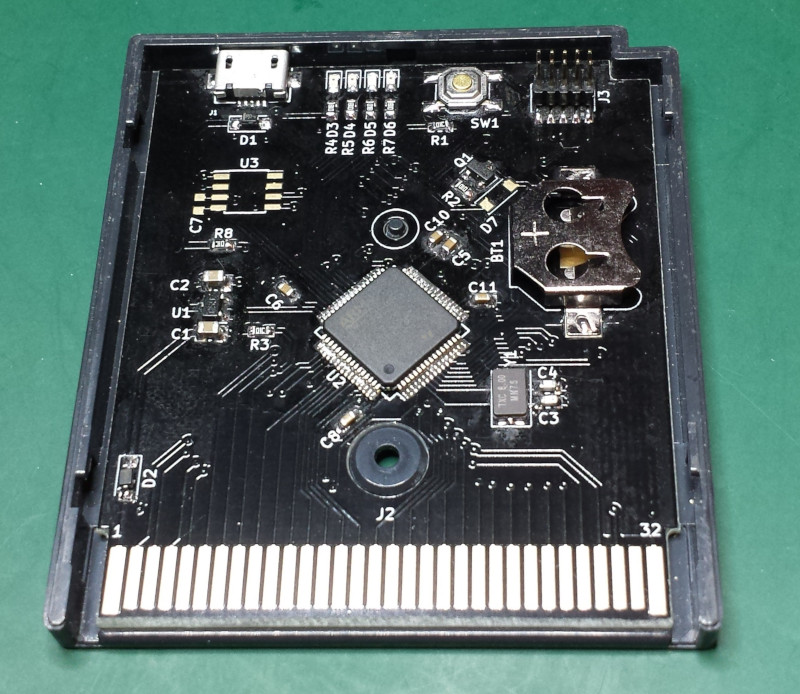

# STM32 GameBoy Cartridge

A GameBoy flashcart based on an STM32F405, with USB, battery backup and external FRAM.

Based on cartridge footprint by Gekkio [https://github.com/Gekkio/gb-hardware](https://github.com/Gekkio/gb-hardware).
